高校社团管理系统（javaweb）

项目代码已收录公众号【java项目源码】，需要请自行关注一下公众号并下载源码

技术：tomcat+servlet+jsp+bootstrap

本系统分为二种用户：

1.管理员：修改密码，用户管理，角色管理，菜单管理，新闻管理，留言管理，财务管理，社团管理，社团风采，社团活动，活动申请，
学生管理，社团申请

2.学生：登陆注册，查看社团，查看新闻，查看活动并申请参与，个人中心，申请社团等等

管理员账号：sys 123456

CSDN博客地址：[高校社团管理系统](https://blog.csdn.net/mataodehtml/article/details/118494469)

运行视频地址：[高校社团管理系统](https://www.bilibili.com/video/BV1Y44y1q7Mf/)

运行截图：
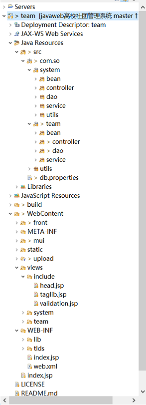

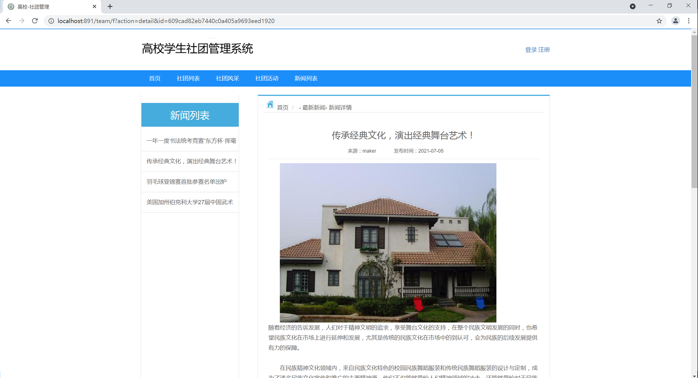

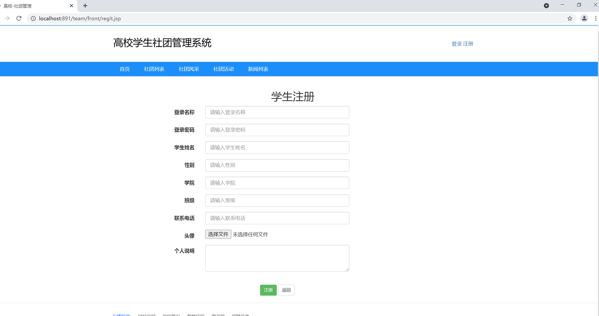

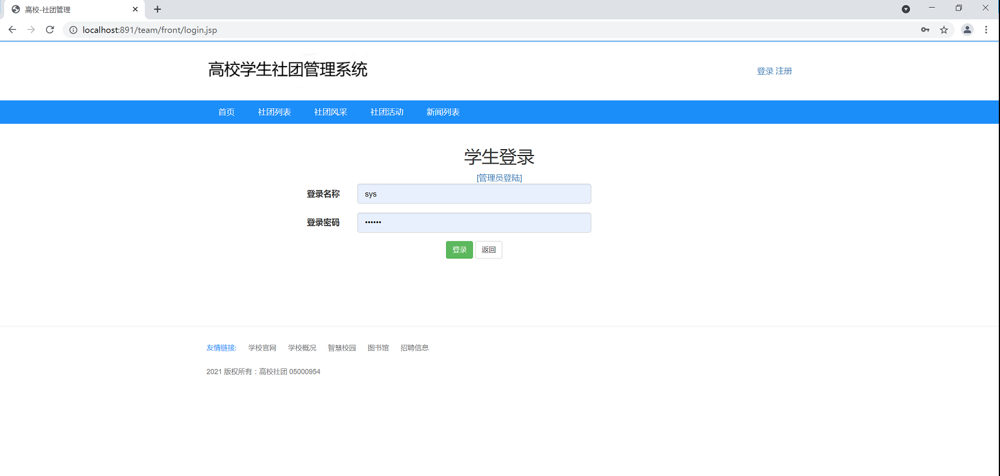

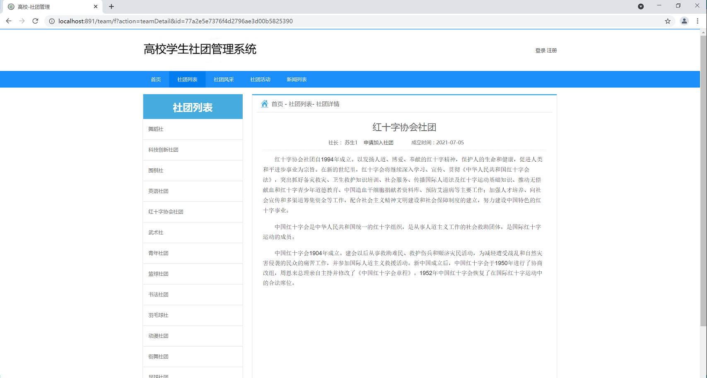

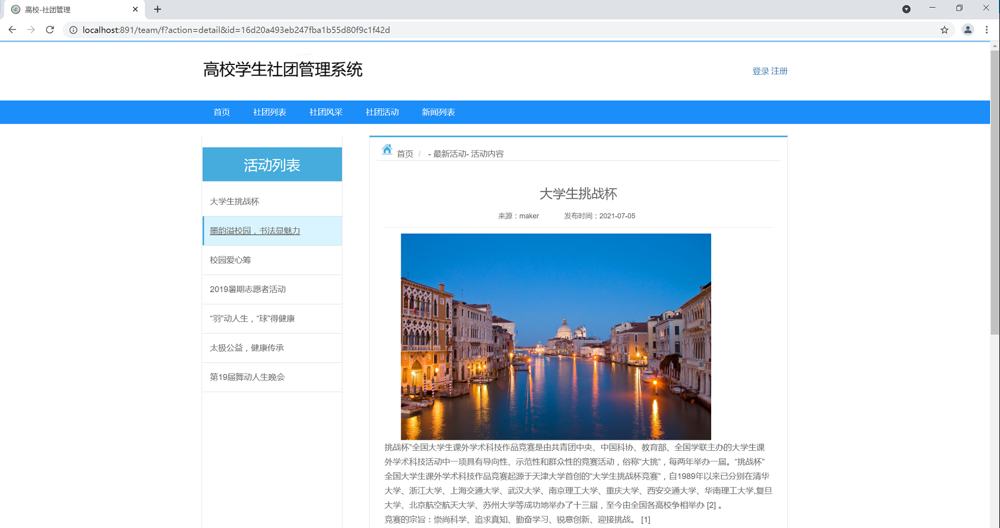

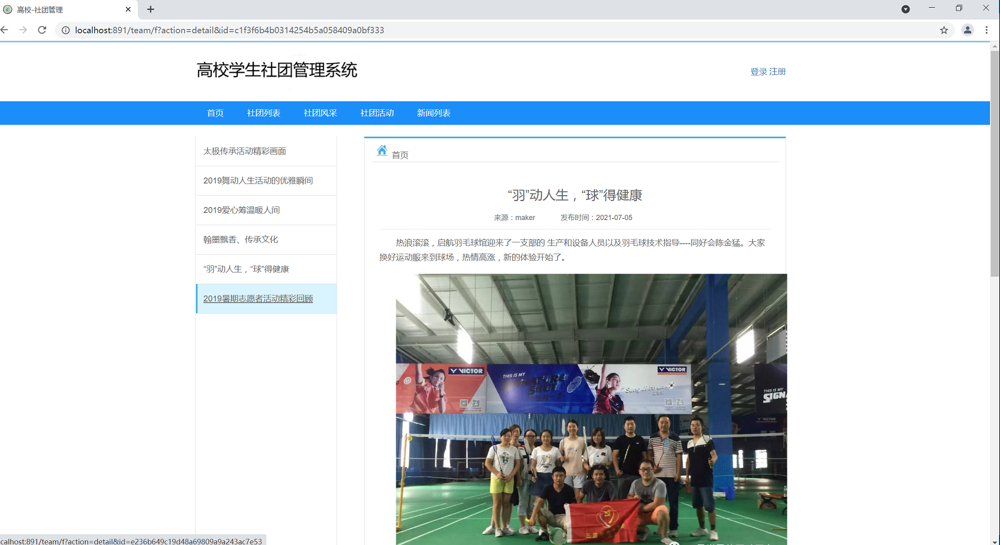

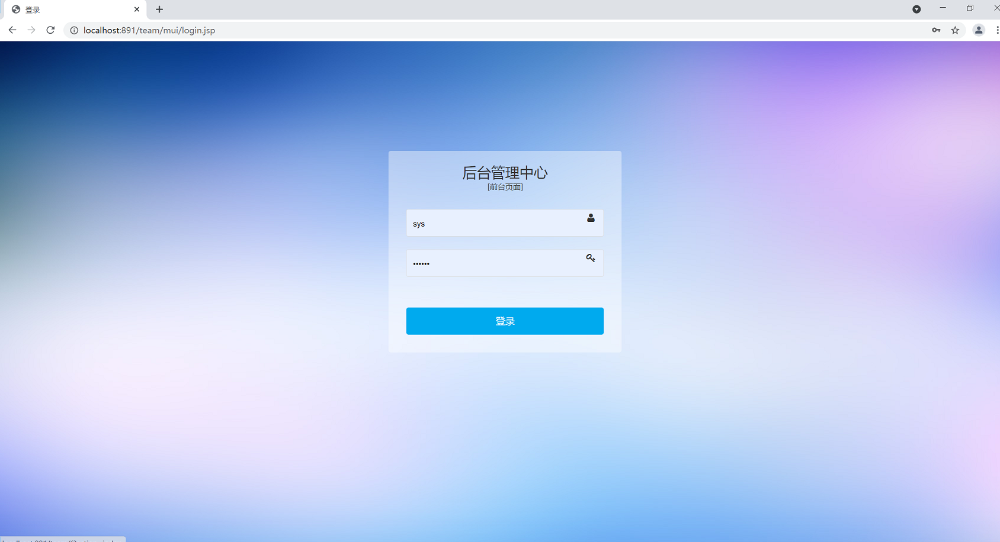

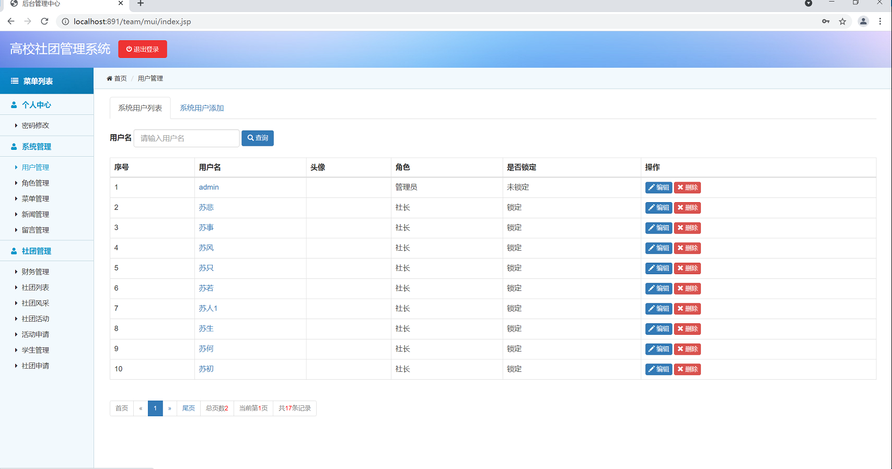

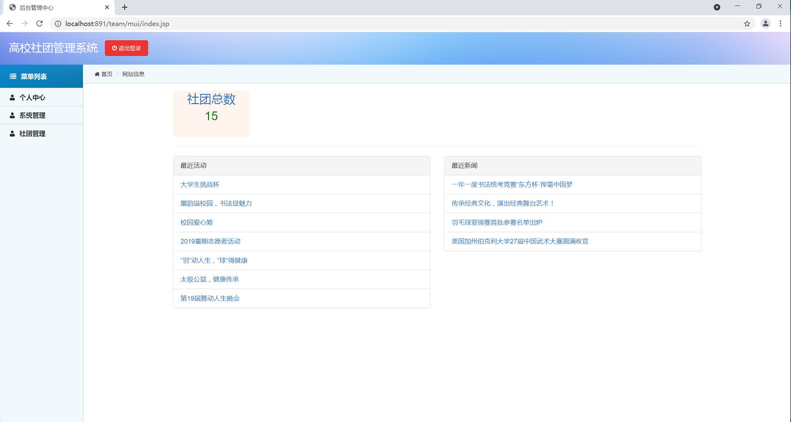

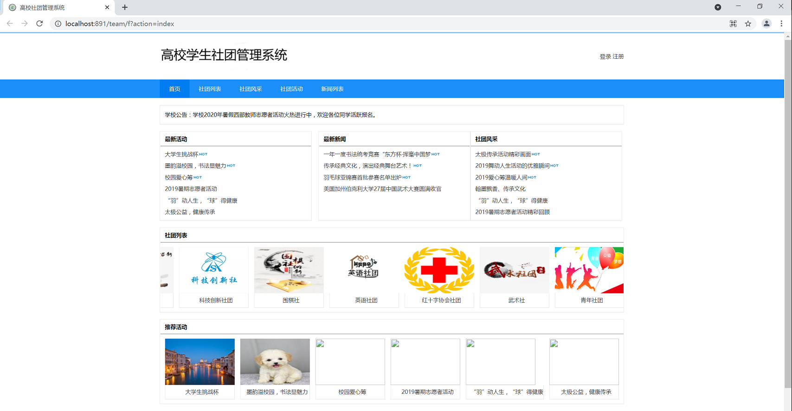